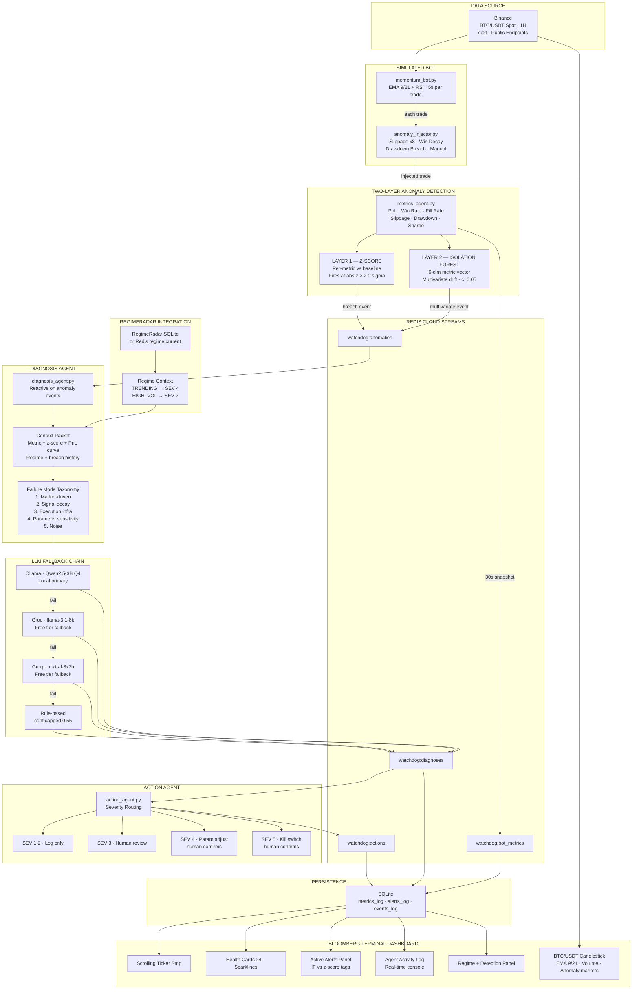

```mermaid
flowchart TD
    subgraph DATASOURCE["DATA SOURCE"]
        BIN["Binance\nBTC/USDT Spot · 1H\nccxt · Public Endpoints"]
    end

    subgraph BOT["SIMULATED BOT"]
        MB["momentum_bot.py\nEMA 9/21 + RSI · 5s per trade"]
        AI["anomaly_injector.py\nSlippage x8 · Win Decay\nDrawdown Breach · Manual"]
        MB -->|each trade| AI
    end

    subgraph DETECTION["TWO-LAYER ANOMALY DETECTION"]
        MA["metrics_agent.py\nPnL · Win Rate · Fill Rate\nSlippage · Drawdown · Sharpe"]
        ZS["LAYER 1 — Z-SCORE\nPer-metric vs baseline\nFires at abs z > 2.0 sigma"]
        IF["LAYER 2 — ISOLATION FOREST\n6-dim metric vector\nMultivariate drift · c=0.05"]
        MA --> ZS
        MA --> IF
    end

    subgraph REDIS["REDIS CLOUD STREAMS"]
        S1["watchdog:bot_metrics"]
        S2["watchdog:anomalies"]
        S3["watchdog:diagnoses"]
        S4["watchdog:actions"]
    end

    subgraph REGIMERADAR["REGIMERADAR INTEGRATION"]
        RR["RegimeRadar SQLite\nor Redis regime:current"]
        RC["Regime Context\nTRENDING → SEV 4\nHIGH_VOL → SEV 2"]
        RR --> RC
    end

    subgraph DIAGNOSIS["DIAGNOSIS AGENT"]
        DA["diagnosis_agent.py\nReactive on anomaly events"]
        CTX["Context Packet\nMetric + z-score + PnL curve\nRegime + breach history"]
        TAX["Failure Mode Taxonomy\n1. Market-driven\n2. Signal decay\n3. Execution infra\n4. Parameter sensitivity\n5. Noise"]
        DA --> CTX --> TAX
    end

    subgraph LLMCHAIN["LLM FALLBACK CHAIN"]
        OLL["Ollama · Qwen2.5-3B Q4\nLocal primary"]
        G1["Groq · llama-3.1-8b\nFree tier fallback"]
        G2["Groq · mixtral-8x7b\nFree tier fallback"]
        RB["Rule-based\nconf capped 0.55"]
        OLL -->|fail| G1 -->|fail| G2 -->|fail| RB
    end

    subgraph ACTION["ACTION AGENT"]
        AA["action_agent.py\nSeverity Routing"]
        R1["SEV 1-2 · Log only"]
        R2["SEV 3 · Human review"]
        R3["SEV 4 · Param adjust\nhuman confirms"]
        R4["SEV 5 · Kill switch\nhuman confirms"]
        AA --> R1
        AA --> R2
        AA --> R3
        AA --> R4
    end

    subgraph STORAGE["PERSISTENCE"]
        SQL["SQLite\nmetrics_log · alerts_log · events_log"]
    end

    subgraph DASHBOARD["BLOOMBERG TERMINAL DASHBOARD"]
        TK["Scrolling Ticker Strip"]
        HC["Health Cards x4 · Sparklines"]
        CC["BTC/USDT Candlestick\nEMA 9/21 · Volume · Anomaly markers"]
        AP["Active Alerts Panel\nIF vs z-score tags"]
        AL["Agent Activity Log\nReal-time console"]
        RP["Regime + Detection Panel"]
    end

    BIN --> MB
    AI -->|injected trade| MA
    ZS -->|breach event| S2
    IF -->|multivariate event| S2
    MA -->|30s snapshot| S1
    S1 --> SQL
    S2 --> DA
    RC --> CTX
    TAX --> OLL
    OLL --> S3
    G1 --> S3
    G2 --> S3
    RB --> S3
    S3 --> AA
    AA --> S4
    S3 --> SQL
    S4 --> SQL
    SQL --> TK
    SQL --> HC
    SQL --> AP
    SQL --> AL
    SQL --> RP
    BIN --> CC
```