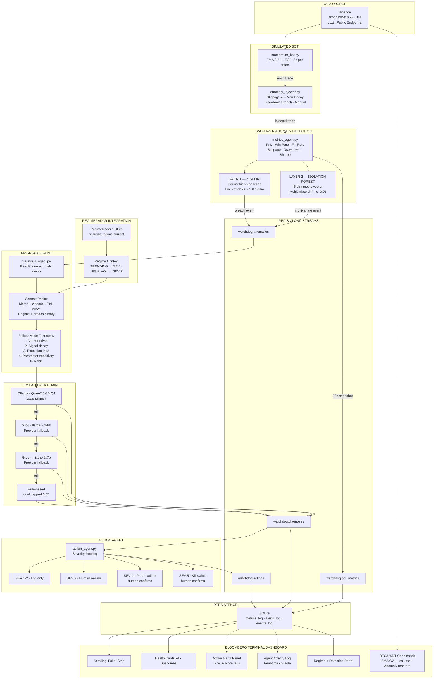

# WatchTower — Multi-Agent Trading Bot Monitor

> Three-agent system that monitors a live trading bot's execution health in real time, detects behavioral anomalies using a two-layer detection engine (z-score + Isolation Forest), and diagnoses root causes using a regime-aware LLM agent with severity-routed action recommendations and a Bloomberg Terminal-style dashboard.

---

## What This Is

Traditional bot monitoring fires alerts when a metric crosses a hard threshold. WatchTower reasons about *why* a metric is anomalous — and the answer depends on market context. A 25% fill rate drop in a HIGH\_VOLATILITY regime is expected (thin liquidity, severity 2). The same drop in a TRENDING regime is a severity-4 execution infrastructure failure. Without regime context, diagnosis is guesswork.

WatchTower integrates directly with **RegimeRadar** to make context-aware decisions, runs a two-layer anomaly detection engine (per-metric z-score for fast threshold breaches + Isolation Forest on 6-dimensional metric vectors for multivariate behavioral drift), and presents everything on a Bloomberg Terminal-style Streamlit dashboard with live candlestick charts, scrolling ticker strip, and real-time agent activity log.

**Stack:** Python · ccxt · Redis Cloud · Isolation Forest (scikit-learn) · Ollama (Qwen2.5-3B Q4) · Groq fallback · SQLite · Streamlit · Plotly

---

## Architecture

### Folder Structure

```
watchtower/
├── README.md                    ← this file
├── requirements.txt
├── config.yaml                  ← all parameters, thresholds, Redis URL
├── main.py                      ← entry point, starts all agents as threads
│
├── bot/
│   ├── momentum_bot.py          ← simulated momentum bot replaying real Binance data
│   └── anomaly_injector.py      ← injects synthetic anomalies at known trade indices
│
├── agents/
│   ├── metrics_agent.py         ← z-score + Isolation Forest detection, Redis publish
│   ├── diagnosis_agent.py       ← LLM-backed regime-aware diagnosis
│   └── action_agent.py          ← severity routing, recommendation generation
│
├── bus/
│   └── redis_client.py          ← Redis Cloud streams: publish, subscribe, read
│
├── llm/
│   └── llm_client.py            ← Ollama primary + Groq fallback chain
│
├── storage/
│   └── watchdog_log.py          ← SQLite: metrics_log, alerts_log, events_log
│
└── dashboard/
    └── app.py                   ← Bloomberg Terminal-style Streamlit dashboard
```

---

## System Design

### Architecture Diagram


---

## The Three Agents

### Agent 1 — Metrics Agent
Single responsibility: ingest bot trade stream, compute health metrics every 30 seconds, run two-layer anomaly detection, publish to Redis. No reasoning, pure measurement.

**Metrics tracked:** `pnl_cumulative` · `pnl_1h` · `win_rate_50` (rolling 50 trades) · `fill_rate` (rolling 20) · `avg_slippage` (rolling 20) · `trade_frequency` · `drawdown_current` · `sharpe_24h`

**Layer 1 — Z-Score:** Per-metric z-score vs 7-day baseline. Fires if `abs(z) > 2.0σ`. Instant, interpretable, named metric in output.

**Layer 2 — Isolation Forest:** Fits once on first 50 trade snapshots as clean baseline. On every subsequent snapshot, predicts on the full 6-dimensional metric vector `[win_rate, fill_rate, slippage, trade_freq, drawdown, sharpe]`. Catches multivariate drift that doesn't breach any single threshold. `contamination=0.05`, `n_estimators=100`.

**Deduplication:** When both layers fire on the same cycle, only the z-score event is published (more interpretable for the LLM). IF fires standalone only for genuine multivariate drift.

### Agent 2 — Diagnosis Agent
LLM agent. Subscribes to `watchdog:anomalies`. Activates only on anomaly events — purely reactive, never polls. Builds a context packet including the current RegimeRadar regime and reasons through a structured failure mode taxonomy. Outputs structured JSON with `anomaly_type`, `severity` (1-5), `confidence`, `reasoning`, `recommended_actions`, and `backend_used`.

### Agent 3 — Action Agent
Receives diagnosis output. Routes by severity. Never acts autonomously — all severity-4 and severity-5 actions require human confirmation on the dashboard.

| Severity | Routing |
|---|---|
| 1-2 | Log to SQLite, dashboard notification only |
| 3 | Prominent warning, flag for human review |
| 4 | Specific parameter adjustment recommended — human confirms |
| 5 | Kill-switch recommended — human confirms with one click |

---

## RegimeRadar Integration

The Diagnosis Agent queries RegimeRadar regime context before diagnosing. The same anomaly means completely different things in different regimes:

| Anomaly | TRENDING | HIGH\_VOLATILITY |
|---|---|---|
| Fill rate −25% | SEV 4 — execution failure | SEV 2 — expected, thin market |
| Win rate −10% | SEV 4 — signal decay | SEV 2 — strategy/regime mismatch |
| Slippage +200% | SEV 4 — infrastructure | SEV 3 — partially expected |

Integration reads via Redis stream `regime:current` (if RegimeRadar running) or direct SQLite read from RegimeRadar's database (path configurable). Degrades gracefully if RegimeRadar unavailable.

---

## Simulated Bot

Replays real BTC/USDT 1H candles from Binance (last 90 days). Strategy: EMA9 × EMA21 crossover + RSI > 50 entry, reverse crossover or 2% stop-loss exit, 1% risk per trade, simulated slippage `N(0.05%, 0.02%)`.

### Anomaly Injection Schedule

| Trade Index | Anomaly Type | Mechanism | Expected Diagnosis |
|---|---|---|---|
| 80 | Slippage spike | ×8 slippage multiplier for 20 trades | Execution infrastructure, SEV 3-4 |
| 150 | Win rate decay | Flip 40% of winning trades to losses for 30 trades | Signal decay, SEV 4 |
| 300 | Drawdown breach | Force 5 consecutive losing trades | Market-driven or signal decay, SEV 4-5 |

Manual injection available via dashboard sidebar function key buttons.

---

## Dashboard — Bloomberg Terminal Style

Built with JetBrains Mono typography, `#0A0A0F` base background, and `#00FF88` terminal green accent.

| Zone | Content |
|---|---|
| Ticker Strip | Scrolling marquee: Win Rate · Fill Rate · Drawdown · PnL · Regime · Backend |
| Header | WATCHDOG·AI blinking cursor · UTC clock · Redis/Ollama/Groq status dots |
| Health Cards ×4 | Cumulative PnL · Win Rate · Fill Rate · Drawdown — each with sparkline, z-score badge, color strip |
| Price Chart | BTC/USDT 1H candlestick · EMA 9/21 overlays · Volume bars · Anomaly markers |
| Metrics Timeline | Normalised win\_rate / fill\_rate / slippage overlay |
| Active Alerts | Terminal log entries · `◈ MULTIVARIATE ANOMALY` for IF · `◉ THRESHOLD BREACH` for z-score · Bloomberg function key severity badges |
| Agent Log | Real-time console · color-coded by agent · auto-scrolls to bottom |
| Snapshot Table | Last 20 metric snapshots with IF status column |
| Regime Panel | Large regime display · confidence bar · detection engine status · anomaly type distribution chart |

---

## Running Instructions

### Prerequisites
- Python 3.10+
- Ollama running: `ollama serve` (Qwen2.5-3B already pulled from RegimeRadar setup)
- Redis Cloud free account: https://redis.io/try-free — create free database, copy connection string
- (Optional) Groq free API key: https://console.groq.com

### Install
```bash
pip install -r requirements.txt
```

### Configure `config.yaml`
```yaml
redis:
  url: "redis://default:<password>@<host>:<port>"   # from Redis Cloud dashboard

groq:
  api_key: "your_groq_key"                          # optional, free tier

regimeradar:
  sqlite_path: "../regime_detector+simulations/storage/regime_agent.db"
```

### Run
```bash
# Terminal 1 — agents + bot
python main.py

# Terminal 2 — dashboard
streamlit run dashboard/app.py
```

Dashboard: `http://localhost:8501`

### Verify Components Individually
```bash
python -m bus.redis_client       # Redis connection test
python -m bot.momentum_bot       # Binance fetch + 5 trade preview
python -m llm.llm_client         # Ollama + Groq chain test
python -m agents.metrics_agent   # IF training + anomaly detection test
```

### Demo Flow
1. Bot starts replaying BTC/USDT historical trades
2. Baseline establishes after 50 trades (~4 minutes at default 5s/trade speed)
3. Isolation Forest trains automatically at trade 50 — log shows `Isolation Forest trained on 50 metric snapshots`
4. Trade 80: slippage spike injected — watch Diagnosis Agent activate in Agent Activity Log
5. Trade 150: win rate decay — SEV 4 alert fires, LLM reasoning appears in Active Alerts panel
6. Use sidebar `[SLIP SPIKE]` / `[WIN DECAY]` / `[DWN BRCH]` buttons for live demo injection

---

## Known Limitations

**49 trades from 90-day history:** BTC momentum strategy with 1H candles on 90 days generates ~49 trades. Baseline requires 50. Extend `history_days` to 120+ in config to ensure baseline establishes. Alternatively reduce `baseline_trades` to 40.

**IF training on clean data only:** The model fits once on the first N observations and never retrains. If the bot starts in an anomalous state, the baseline will be corrupted. In production, a warm-up period before enabling injection is recommended.

**RegimeRadar schema dependency:** The diagnosis agent queries RegimeRadar's SQLite with known table names (`regime_log`). If RegimeRadar schema changes, update the query in `diagnosis_agent._get_regime_context()`.

---

## Related Project

**RegimeRadar** — LLM-powered market regime detection agent (Project 1). WatchTower reads RegimeRadar's regime output to provide market context for bot anomaly diagnosis. Both projects form a complete intelligence-to-execution monitoring stack:

```
RegimeRadar → detects market regime → WatchTower uses regime as diagnostic context
AlphaTrade  → executes trades       → WatchTower monitors execution health
```

---

*Built as part of a quantitative research portfolio targeting LLM-augmented trading infrastructure.*